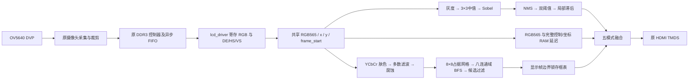

# 赛题四：基于 FPGA 的实时图像边缘检测系统

> **2026-09-25 最新入口：本目录 `README_赛题增强.md`。** 已新增 K2 冻结/恢复、14 模式、高斯 Canny 路径及受控图形实验，12 项测试与 Efinity 通过；下载器未枚举，本轮尚未上板，Flash 未改。以下状态和旧路径保留为历史，请勿据此验收新版。

> 2026-09-24 第一阶段已完成本地RTL修改、八项仿真和Efinity实现，新增模式5/6/7与集中参数，**未下载板卡**。当前版本以 [第一阶段交付说明](D:/yilingsi_fpga/Efinity_Project/2026.9.22/9.22.2_ding_Ti60F225_Canny_Face_Parallel/README_第一阶段.md) 和 reports/stage1_20260924 下的结果为准。下文9月22日的五模式、资源、JTAG和用户确认记录作为历史保留，不代表新增版本已经上板。实拍样本标定仍待完成。

## 交付状态与定位

队伍已确认选择 **赛题四**。依据用户提供的《易灵思.pdf》第 12—17 页，平台为 VF-Ti60F225，主线为摄像头采集、灰度化、去噪、Sobel/边缘二值化及实时显示。人脸候选区域检测属于创新扩展。

工程目录：`D:\yilingsi_fpga\Efinity_Project\2026.9.22\9.22.2_ding_Ti60F225_Canny_Face_Parallel`。

Efinity 2025.1.110.5.9 综合、接口生成、布局布线、bitstream 全部 PASS；XSim 自动检查通过；JTAG 已下载 Ti60，ID `0x10660A79`，退出码 0。用户已确认第一版彩色叠加的画面、边缘、人脸框正常。按用户反馈，最终默认改为 **模式 3：黑底白边＋红色人脸框**，已重新测试、编译、下载。最终黑白画面的用户反馈见 `reports/board_acceptance.md`。

两个原工程保持原样；主工程 392 项 RTL/约束/XML SHA256 复核无变化。新工程未同时例化两套 Canny。详细审计与逐文件对比见 `reports/audit.md`、`reports/source_comparison.json`；修改清单见 `reports/changed_files.md`。

## 系统结构与真正并行



两个分支同时采样同一 DDR 显示像素流。Canny 不给肤色分支喂数据，人脸检测也不会阻塞边缘输出。核心计算均为 FPGA RTL。Python 只用于工程审计/测试资料整理，没有参与板上算法。

Canny 按像素流水运行，每个有效像素时钟接收一个像素；输出保持完整 1280×720 raster，每个有效时钟输出一个 RGB。边界无法形成完整窗口时边缘为 0，不缩短 HDMI DE。人脸前处理同样逐像素运行；八连通 BFS 是 FPGA 状态机，对已经捕获的网格在后台处理，与下一帧采集和 Canny 并行，不能将其宣传为每像素当拍生成最终人脸框。

## Canny 分支

- RGB565 用高位复制扩展 RGB888；灰度为 `(77R+150G+29B)>>8`，移位加法，无除法器。
- 3×3 中值比较网络去椒盐噪声。按最初需求选择中值替代高斯，是 Canny 变体。
- 3×3 Sobel：`Gx=右列加权和−左列加权和`，`Gy=下行加权和−上行加权和`，幅值为 `|Gx|+|Gy|`，保留 12bit。
- 梯度方向分成 0/45/90/135 度，边界采用幅值 2:1 近似。
- NMS 沿方向比较两邻居，使用 `center>n1 && center>=n2`，固定打破平局，避免阶跃双像素边缘。
- 低/高阈值默认 40/80，强边≥高阈值，弱边≥低阈值。
- 滞后连接：保留强边；弱边与 3×3 邻域强边相邻则保留，孤立弱边去除。**这是单次局部滞后，不能递归追踪任意长度弱边链，不能声称与完整离线 Canny 等价。**
- 四个窗口使用同步读块 RAM。窗口有效范围最终为 x=4..1275、y=4..715；四周 4px 无边缘。

## 人脸候选检测分支

准确名称：**基于肤色分割、形态学处理和连通域分析的人脸候选区域检测**。不是身份识别、神经网络或高精度 AI 人脸识别。

YCbCr 整数变换后条件为 Y=40..235、Cb=77..127、Cr=133..173；随后 3×3 五票多数滤波、3×3 腐蚀。二值图同步恢复到完整 raster，两像素边界置零。

每 8×8 单元统计肤色占据数，达到 24 则为前景。160×90 网格使用双缓冲，八邻域 BFS 检测连通域，入队即清除标记防重复。队列与网格采用块 RAM，结果最大 8 个框。过滤包括宽 40..640、高 48..640、网格估算面积≥1800、填充率≥25%、宽高比 0.6..1.6。

注意面积为“前景网格数×64”的粗估，非精确肤色像素面积。框坐标量化为 8px。红框厚度 2px；没有增加帧间低通，避免跟踪滞后及旧框延留。肤色相近背景、手臂等仍可能误检。

## 精确延迟与帧发布

延迟以 parallel_video 输入为基准，用普通 D 级寄存链的定义：输入在第 n 个边沿被采样，在第 n+D−1 个边沿后出现输出。H_TOTAL=1650，消隐也计入时钟延迟。

| 级 | 该级寄存延迟 | 新增空间前瞻 | 累计等效时钟延迟 |
|---|---:|---:|---:|
| 灰度 | 1 | 0 | 1 |
| 中值窗口＋中值 | 2+1 | 1行+1列 | 1655 |
| Sobel窗口＋Sobel | 2+1 | 1行+1列 | 3309 |
| NMS窗口＋NMS | 2+1 | 1行+1列 | 4963 |
| 双阈值 | 1 | 0 | 4964 |
| 滞后窗口＋连接 | 2+1 | 1行+1列 | 6618 |
| RGB/DE/HS/VS/x/y 并行补偿 | 6618 | 已含全部 | 6618 |
| 融合输出寄存 | 1 | 0 | **6619** |
| 肤色＋两组形态学窗口/处理 | 1+3+3 | 2行+2列 | **3309** |

Canny 总计 **4 行＋18 拍 = 6618 拍**；融合前彩色/控制/坐标全部打包入同一 RAM 延迟。不是只延迟 RGB。融合后 **4 行＋19 拍 = 6619 拍**，按保留的 74.4MHz 约 88.97μs。该数不包含摄像头及 DDR 帧缓存延迟，也不包含原 TMDS 编码器自身延迟。

VS/HS 保持原 active-low 极性；输入 VS 上升沿在消隐期清窗口/提交阈值；显示 VS 上升沿提交模式及完成的框表。line_start 等价 `de && x==0`。不直接使用原 lcd_request 配合原始数据猜相位。

人脸框并非当前像素即时结果。第 N 帧网格在完整捕获后计算，计算完成后仅在下一个显示 VS 上升沿发布。默认 720p 的 BFS 最短扫描也超过当前垂直消隐可用时间，因此正常显示使用 **N−2 帧** 已完成结果；框不会在帧内改变。空帧结果同样在发布边界清空，允许算法固有两帧延迟，不会无限保留旧框。默认最坏全前景 720p 实测 **443411** 个时钟，约 5.96ms；720p 每帧 1237500 时钟，有足够后台预算。发生超时则 LED[4] 锁存报警并丢弃该次待处理网格，不影响 HDMI。

## 模式与运行时参数

原 peri.xml 没有启用板载按键端口。为保留既有引脚配置，本版通过已约束 UART RX 调参，**未完成“板载按键＋消抖”项目**，不能宣称通过按键验收。

UART：115200、8 数据位、无校验、1 停止位。接收器位于 clk_pixel 域，RX 经两级同步；字节指令：

| 字符 | 功能 |
|---|---|
| `0` | 原始彩色 |
| `1` | 纯黑底白色二值 Canny，不画框 |
| `2` | 彩色原图＋绿色普通边缘＋框内黄色边缘＋红框 |
| `3` | **默认：黑底白色边缘＋红框** |
| `4` | 黑底，框内黄色边缘，框外暗灰边缘，红框 |
| `m` | 在 0..4 循环 |
| `+` | 低阈值+8，高阈值+16 |
| `-` | 低阈值−8，高阈值−16 |
| `r` | 恢复模式3、阈值40/80 |

低阈值限制 8..1000，高阈值 16..2000，始终高于低阈值。阈值在输入帧边界生效，模式在显示帧边界生效。UART TX 当前空闲，无状态回读。现有约束 UART IO 是 **1.8V**；具体外接应使用开发板原配接口/匹配电平，不直接按3.3V裸IO接法推断。实物按键切换和 UART 外部指令尚未完成现场实测，UART RTL 自检已通过。

## 仿真证据

运行 `tools/run_parallel_tests.ps1`，使用 D:/Xilinx/Vivado/2018.3/bin 的 xvlog/xelab/xsim；仅作为 RTL 仿真器，综合和实现全部用 Efinity。

| 自检 | 结果 |
|---|---|
| tb_parallel | PASS：黑图；逐行单像素阶跃；矩形108点且八连通；RGB/DE/HS/VS全时钟对齐；Canny/形态学坐标一致；帧清除 |
| tb_parallel 形态学 | PASS：768肤色像素经滤波/腐蚀剩656；单肤色孤立点完全抑制 |
| tb_720p | PASS：3帧完整720p，2716992个有效内区输出，均匀图无伪边缘，无CCL超时 |
| tb_face_grid_regions | PASS：两个分离目标、八邻域对角连接、贴边框、全前景、空帧清框、帧内稳定；小/宽/窄区域拒绝 |
| tb_controls | PASS：5模式颜色优先级、同步，UART模式/阈值/复位/上下限 |
| canny_threshold_ports_tb | PASS：150018项，err=0 |
| hysteresis_local_tb | PASS：100015项，err=0，含弱强分类/孤立弱边/邻接强边 |
| rgb565_to_ycbcr_skin_tb | PASS：100032项，err=0，含非肤色、暗部、过曝及控制透传 |

日志在 sim_parallel/。原工程遗留 tb/vision/nms3x3_tb.v 等可能仍按旧平台比较规则编写，不属于本版回归入口，不能将这些旧测试的预期套到新规则上。

## Efinity 编译、资源与时序

正式最终编译日志：`reports/compile_04_binary_default.log`。最终数值见 `reports/final_results.json`，原始报告位于 outflow/。

| 资源 | 使用 | 比例 |
|---|---:|---:|
| EFX_LUT4 | 7119 | 60800 XLR容量的11.71%（统计口径见下） |
| EFX_FF | 5978 | 60800 XLR容量的9.83% |
| EFX_RAM10 | 147 | 256存储块的57.42% |
| EFX_DPRAM10 | 4 | 256存储块的1.56% |
| 全部存储块 | 151/256 | 58.98%，剩余41.02% |
| EFX_DSP48 | 3 | 160 DSP块的1.875% |
| EFX_DSP24 | 1 | 占用另一个DSP物理块 |
| DSP物理块 | 4/160 | 2.50% |
| XLR（含逻辑、FF、加法器、SRL） | 13158/60800 | 21.64%，剩余78.36% |

LUT/FF 共用 XLR，百分比不能直接相加视为芯片占用。最终物理资源以 route.rpt 的 XLR 和 Memory Blocks 为准，满足20%逻辑和15%存储余量目标。

最终最差 setup **+0.317ns**；最差 hold **+0.026ns**；clk_pixel setup **+3.326ns**，hold **+0.026ns**。全部被分析时钟关系非负。原 SDC 和 peri.xml 没有通过放宽或删除约束掩盖违例。

保留原 PLL：实际 clk_pixel 约 **74.4MHz**（约60.12Hz，1650×750），并非注释中的精确74.25MHz；DDR core约192MHz而非200MHz。用户要求优先保留现有时钟，因此未改PLL。当前显示器已接受原时序；对所有显示器的标准兼容性不能仅凭该次测试保证。

继承工程有未使用接口、端口位宽等告警以及既有 CDC 例外。STA 通过表示现有约束覆盖内通过，不等于额外证明全部异步输入/板外接口。新视频算法没有多位像素 CDC，摄像头/DDR/显示跨域继续经原异步 FIFO 和 DDR 控制器。

## 构建与下载

在工程目录 PowerShell：

```powershell
& .\tools\run_parallel_tests.ps1
& 'C:\Efinity\2025.1\bin\python3.bat' 'C:\Efinity\2025.1\scripts\efx_run.py' Ti60_Demo.xml --flow compile
```

CLI已实测可运行，不需要把旧笔记“必须先开GUI”当作事实。首次失败原因是新 XML 的非法状态枚举，修正为合法值后可直接编译；另一次失败是精简清单时遗漏 Sensor_Image_XYCrop，已补回。

器件识别与 JTAG 下载：

```powershell
$env:EFINITY_USER_DIR='C:\Users\Lenovo\.efinity'
& 'C:\Efinity\2025.1\bin\python3.bat' 'C:\Efinity\2025.1\pgm\bin\jtag_chain_detect.py' -f 'ftdi://0x0403:0x6014:0:1/1'
& 'C:\Efinity\2025.1\pgm\bin\ftdi_pgm.bat' -m jtag -u 'ftdi://0x0403:0x6014:0:1/1' -b 'Generic Board Profile Using FT232' outflow\Ti60_Demo.bit
```

实际 FT232H 仅一个通道，厂商检测脚本自动使用第二通道会报 IndexError，因此指定实测 URL。最终下载日志 `reports/jtag_program_binary_default.log`，6MHz JTAG、Ti60 ID=0x10660A79、正常完成。

下载文件：
- `D:\yilingsi_fpga\Efinity_Project\2026.9.22\9.22.2_ding_Ti60F225_Canny_Face_Parallel\outflow\Ti60_Demo.bit`
- `D:\yilingsi_fpga\Efinity_Project\2026.9.22\9.22.2_ding_Ti60F225_Canny_Face_Parallel\outflow\Ti60_Demo.hex`

这是易失 JTAG 配置，没有烧写非易失 Flash；断电需重新下载。bit/hex SHA256 和源文件快照记录在 reports/build_manifest.json。

## 对赛题四的准确对应与待补项

已实现：≥640×480采集显示（本版1280×720）、移位加法灰度、Sobel L1、二值输出、行缓存、逐像素流水、中值滤波、DDR帧缓存、彩色边缘叠加、运行时阈值、人脸候选扩展。

必须准确说明的差异：
1. 官方 Canny 高阶项写的是高斯滤波；本版遵循初始用户许可选择中值变体，且滞后为局部一次连接。不能标注“完整递归 Canny 严格等价”。
2. 官方要求板载按键/拨码调阈值，本版只有已约束 UART；未满足该硬件交互高阶项。
3. 官方基础显示描述为灰度/边缘分屏或画中画，本版提供全屏切换及彩色像素叠加，没有实现严格的灰度分屏/画中画布局。彩色叠加对应另一个高阶项，不能自动将其宣称为严格覆盖全部基础显示细则。
4. 人脸候选是并行肤色网格八连通，不是“从边缘中识别圆/矩形”的官方示例；扩展性质需要在答辩中解释清楚。
5. 两帧框延迟、8px框量化、无帧间平滑；局部弱边链可能断裂；中值可能删除很窄的线条。
6. 没有录制演示视频，没有测量摄像头实际帧率/长时间丢帧率，没有冻结/回放功能。用户确认的短时画面正常不等于长期稳定性量化测试。

## 现场演示建议

先演示默认黑底白边＋红框，使用棋盘格、粗数字/字母、矩形。然后发送 `0` 展示原图、`1` 展示纯二值、`2` 展示彩色叠加、`4` 展示人脸框内轮廓。改变正面光照/人物距离，说明肤色算法局限；演示 `+/-` 改变边缘灵敏度。录屏时同时拍到开发板、摄像头、HDMI显示器和阈值操作，说明所有核心计算在 FPGA。
