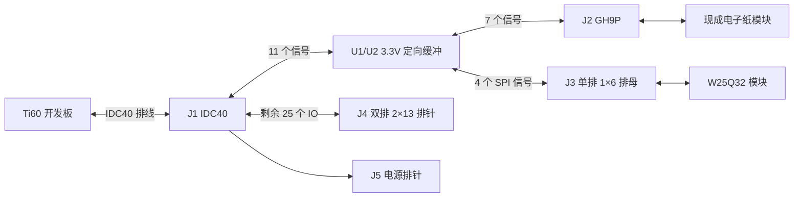

# IDC40 → GH9P 电子纸 + W25Q32 模块底板

日期：2026-09-26。用户确认使用一块现成微雪 5.79 英寸 B 版电子纸模块，以及六针在同一侧的现成 W25Q32 模块。本文是可供画图的接线设计，不是已完成 ERC/DRC 或实测的 CAD 原理图/PCB。

可视化入口：[接线与流程总览](接线与流程总览.html)。包含四张可缩放流程图、电子纸/Flash/缓冲完整脚表和可搜索的IDC40表；单图另提供同名SVG/PNG。[逐步传图说明](详细传图流程.md)解释命令、图片预存与运行调度。

用户最新截图核对：IDC电源布局可作为起点；电子纸DIN仍接IO0、RST仍接IO8、PWR仍接IO12，应按本文改成IO14/IO16/IO22。CLK→IO2、CS→IO4、DC→IO6、BUSY→IO10对应关系保留，但加入缓冲。电子纸连接器位号U1建议改J2，U1/U2留给缓冲；另补Flash、剩余排针与去耦。

## 1. 结构和设计边界

采用两组独立标准 SPI：电子纸 7 个信号、Flash 4 个信号，共 11 个 FPGA IO。原 IDC40 中有 36 个信号 IO，剩余 25 个全部引出，但其中有按键和配置复用脚，不能称为 25 个空闲通用 IO。

实际数据流程：识别结果 → FPGA 内 RISC-V 选择图片 → SPI 读取 Flash → 1～4KiB 小缓冲 → 电子纸 SPI 写入 → 触发刷新并等待 BUSY。底板不需要再放 CPU，也不需要复制电子纸模块已有的升压电路。Flash 不会自行向电子纸发送图片。

接口编号为本底板新编号，不等同于开发板/模块原理图中同名位号。

| 位号 | 器件 | 作用 |
|---|---|---|
| J1 | 带防反插定位的 2×20 IDC40 插座 | 接开发板 P4 的 40 芯排线 |
| J2 | GH9P 接口 | 接电子纸模块九根信号/电源线 |
| J3 | 单排 1×6 排母 | 按用户图片顺序 VCC、CS、DO、GND、CLK、DI；针距和机械尺寸待按实物确认 |
| J4 | 2×13、2.54mm 排针 | 25 个未分配 IO + 1 个 GND |
| J5 | 1×4、2.54mm 排针 | 3.3V / GND / 5V / GND 电源引出 |
| U1、U2 | SN74LVC244APWR，PW/TSSOP-20 | 共 16 路非反相缓冲，使用其中 11 路 |
| JP1 | 1×2 跳帽 | 缓冲输出使能，便于接口联调 |

J1 的针距、定位槽和插拔方向必须与现有 IDC 排线一致。GH9P 的具体型号、出线方向、配套线束逐针对应关系需核对实物；“九针”本身不能确定插座封装与线序。Flash 针序已能从用户补充商品图辨认，针距尚未给出；可暂按常见 2.54mm 选型，但下单 PCB 前须核对商品规格或实物。

## 2. 电源

- J1-29 = `3V3_IN`，给 U1/U2、J2-1、J3-VCC 和 J5-1 供电。
- J1-12、J1-30 均接地平面；J2-2、J3-GND、所有去耦和 J5 地接同一地。
- J1-11 = `5V_IN`，仅引到 J5-3；本方案电子纸、Flash 和缓冲均使用 3.3V。
- J1 附近放 22µF + 100nF；J2 附近放 10µF + 100nF；J3 附近放 1µF + 100nF；U1/U2 各紧靠电源脚放 100nF。模块自身去耦仍保留。
- 可在 3.3V 入口串 0Ω 测流/隔离位置；不默认增加另一个稳压器或并接独立 3.3V 电源。
- 供电经排线，整机带屏刷新时应检查底板 3.3V 压降。电源余量、最大线长和扩展负载能力本次未实测。

底板所接 P4 信号默认是 3.3V；原开发板已有 TXS0108E，把核心 FPGA 的 1.8V 转为 3.3V。本文 11 路 FPGA 管脚仍应设置 `1.8 V LVCMOS`，不能改为 3.3V。实际底板 R1/R10 电压选择需保持默认 3.3V。

## 3. GH9P 电子纸接口

使用此前核对过的分配，避开 K1/K2、板载配置 Flash、CBSEL0/1。表中 IO14 是 `User_3V3_IO14` 的简写。信号均经过后述缓冲，不是直接短接两端。

| J2 脚 | 模块信号 | J1 脚 | 开发板 IO | FPGA 球位 | FPGA GPIO / Bank | FPGA 方向 |
|---:|---|---:|---:|---|---|---|
| 1 | VCC | 29 | — | — | — | 电源 |
| 2 | GND | 12、30 | — | — | — | 地 |
| 3 | DIN | 17 | IO14 | G2 | GPIOL_N_10 / 1B | 输出 |
| 4 | CLK | 3 | IO2 | K2 | GPIOL_N_06 / 1A | 输出 |
| 5 | CS | 5 | IO4 | H3 | GPIOL_N_08 / 1A | 输出 |
| 6 | DC | 7 | IO6 | J3 | GPIOL_N_05 / 1A | 输出 |
| 7 | RST | 19 | IO16 | F5 | GPIOL_N_11 / 1B | 输出 |
| 8 | BUSY | 13 | IO10 | G4 | GPIOL_N_12 / 1B | 输入 |
| 9 | PWR | 25 | IO22 | G1 | GPIOL_N_09 / 1B | 输出 |

这是按模块原理图 P1 信号编号建立的目标线序。采购/压接线束后，必须核对 J2-1 实际到模块 VCC，不能仅按插头正面左右位置或线色判断。连接器固定焊盘按选定连接器图纸处理，不属于第 10/11 路信号。

## 4. 六针 Flash 模块接口

本方案针对支持 3.3V 供电和 3.3V 逻辑的 W25Q32 模块，例如 W25Q32JV；不能把任意后缀的 W25Q32 都认定为 3.3V。W25Q32JV 是 32Mbit = 4MiB，供电范围 2.7～3.6V。

用户商品图中，元件面朝向观察者，左侧单排焊孔从上方 VCC 方焊盘开始依次为 **VCC、CS、DO、GND、CLK、DI**。本底板据此定义 J3-1 为 VCC、J3-6 为 DI。照片标注模块板尺寸约 14mm×15mm，未标排针节距；模块翻面安装时坐标会镜像，仍以针号和电气连通为准。

| J3 脚号 | 模块丝印 | 原理图信号 | J1 脚 | 开发板 IO | FPGA 球位 | FPGA GPIO / Bank | FPGA 方向 |
|---:|---|---|---:|---:|---|---|---|
| 1 | VCC | 3V3 | 29 | — | — | — | 电源 |
| 2 | CS | FLASH_CS | 27 | IO24 | F2 | GPIOL_N_14 / 1B | 输出 |
| 3 | DO | FLASH_MISO | 24 | IO21 | K1 | GPIOL_P_07 / 1A | 输入 |
| 4 | GND | GND | 12、30 | — | — | — | 地 |
| 5 | CLK | FLASH_CLK | 26 | IO23 | H1 | GPIOL_P_09 / 1B | 输出 |
| 6 | DI | FLASH_MOSI | 23 | IO20 | J1 | GPIOL_N_07 / 1A | 输出 |

商品图内芯片字样为 25Q16 系列，页面选项写 W25Q32，可能多容量共用示意图。购买/收货时确认实际是 3.3V W25Q32；上板后读 JEDEC ID 核对容量。本方案不把商品图片当作已经确认收到 W25Q32 的证据。

核实模块已正确处理 /WP、/HOLD 引脚。六针普通 SPI 模块通常在模块内处理，但本次未看到所购模块电路，不能当成已确认。不要把此处 MOSI/MISO 名称倒接：MOSI 是 FPGA 发给 Flash 的指令/地址/写数据；读出的图片从 MISO 返回 FPGA。

Flash 与电子纸各有独立 SCK、MOSI、CS。电子纸 DIN 不直接连接 Flash DO；图片读取和电子纸命令由 FPGA 控制。

## 5. 缓冲电路：可直接按脚号画图

原开发板 TXS0108E 与电子纸模块 TXB0108 直接级联存在上拉/驱动兼容性问题。此底板采用高阻输入、固定 A→Y 方向的 SN74LVC244A，将两者隔开。Flash 接口也使用缓冲，便于排线连接和返回信号驱动。此选型解决的是电气接口驱动，不能保证未测量线束在任意长度/频率下都可靠。

**以下芯片脚号仅适用于所列 PW/TSSOP-20 常规封装，不要套用到不同引脚排列的封装。** 两片均 20 脚接 3.3V，10 脚接 GND。

为了避免缓冲两端被错误画成同一网络，FPGA/IDC 一侧命名 `HOST_EPD_*`、`HOST_FLASH_*`；模块一侧命名 `EPD_*`、`FLASH_*`。A 与 Y 不同名，不加并行直通线。

U1 八路全部用于板卡向外设输出：

| 信号 | U1 输入 A 脚 | 输入来源 | U1 输出 Y 脚 | 输出去向 |
|---|---:|---|---:|---|
| EPD_DIN | 2 | J1-17 / IO14 | 18 | J2-3 |
| EPD_CLK | 4 | J1-3 / IO2 | 16 | J2-4 |
| EPD_CS | 6 | J1-5 / IO4 | 14 | J2-5 |
| EPD_DC | 8 | J1-7 / IO6 | 12 | J2-6 |
| EPD_RST | 11 | J1-19 / IO16 | 9 | J2-7 |
| FLASH_CS | 13 | J1-27 / IO24 | 7 | J3-2 / CS |
| FLASH_CLK | 15 | J1-26 / IO23 | 5 | J3-5 / CLK |
| FLASH_MOSI | 17 | J1-23 / IO20 | 3 | J3-6 / DI |

U2 三路中两路反向接入，即输入在外设侧、输出在 IDC 侧；芯片内部仍是 A→Y，不需要 DIR：

| 信号 | U2 输入 A 脚 | 输入来源 | U2 输出 Y 脚 | 输出去向 |
|---|---:|---|---:|---|
| EPD_PWR | 2 | J1-25 / IO22 | 18 | J2-9 |
| EPD_BUSY | 4 | J2-8 | 16 | J1-13 / IO10 |
| FLASH_MISO | 6 | J3-3 / DO | 14 | J1-24 / IO21 |

- U2 未用输入 8、11、13、15、17 接 GND；对应未用输出 12、9、7、5、3 留空并标 NC。
- 两片 1 脚和 19 脚（低有效 /OE）接同一网 `BUF_nOE`。R_EN=10kΩ 将其拉至 3.3V，JP1 将 `BUF_nOE` 短接 GND 后启用。JP1 不插时缓冲输出高阻，方便先核对 FPGA 端口方向。输入不因此自动变成可双向端口。
- 每路已用 Y 输出后预留串联电阻 R_S，初值 33Ω，紧靠 Y 脚。阻值是布局/线束联调起点，可换 0Ω/22Ω，不是已验证的终端匹配。BUSY/MISO 回传电阻也放在 U2 的 Y 侧。
- J2 的 CS、RST 各用 100kΩ 上拉到 3.3V，PWR 用 100kΩ 下拉到 GND；J3.CS 用 100kΩ 上拉到 3.3V。JP1 未使能时保留外设基本默认状态。电子纸信号不增加 4.7kΩ/10kΩ 等强上拉，避免干扰模块 TXB0108。
- U2 输入侧的 EPD_BUSY、FLASH_MISO 各用 100kΩ 下拉，避免屏掉电或 Flash 未选中三态时 CMOS 输入悬空。若模块内已有相反拉电阻，需重新核算，不盲目叠加。
- 九路 HOST 输出缓冲输入可各预留 100kΩ 默认电阻：CS/RST 拉高，CLK/DIN/DC/MOSI/PWR 拉低。作用是排线断开时避免悬空；连接开发板时，其 TXS 内置上拉可能占优，不能据此保证 FPGA 配置前 PWR 为低或 CLK 为低。固件在拉低 CS 前必须主动设置正确状态。

标准 SPI 只需要这两路输入（BUSY、MISO）；它们不能被画成从 IDC 指向模块的输出缓冲。

## 6. 剩余 25 个 IO 引出

J4 采用 2×13 排针，信号从 J1 直接分支引出，不经过 U1/U2。保留原 `User_3V3_IOxx` 网名，避免将这些脚误标为全部可用的 GPIO。下面按 J4 奇偶脚成对排列，J4-26 为 GND。

| J4 奇数脚 | 网络 | J1 脚 | J4 偶数脚 | 网络 | J1 脚 |
|---:|---|---:|---:|---|---:|
| 1 | IO0 / K2共用 | 1 | 2 | IO1 / K1共用 | 2 |
| 3 | IO3 | 4 | 4 | IO5 | 6 |
| 5 | IO7 | 8 | 6 | IO8 / 配置Flash | 9 |
| 7 | IO9 / 配置Flash | 10 | 8 | IO11 | 14 |
| 9 | IO12 / CBSEL1 | 15 | 10 | IO13 / CBSEL0 | 16 |
| 11 | IO15 | 18 | 12 | IO17 | 20 |
| 13 | IO18 / 配置Flash | 21 | 14 | IO19 / 配置Flash | 22 |
| 15 | IO25 | 28 | 16 | IO26 / TEST_N | 31 |
| 17 | IO27 / NSTATUS | 32 | 18 | IO28 | 33 |
| 19 | IO29 | 34 | 20 | IO30 | 35 |
| 21 | IO31 | 36 | 22 | IO32 | 37 |
| 23 | IO33 | 38 | 24 | IO34 | 39 |
| 25 | IO35 | 40 | 26 | GND | 12、30 |

IO0/1、8/9、12/13、18/19、26/27 共 10 路在丝印标“复用/保留”。其余 15 路也需查当前工程占用后使用；引出排针不会解除旧 LCD 等端口约束。不得在未释放端口时另接输出驱动。

J5：1=3.3V，2=GND，3=5V，4=GND。清楚区分 5V 电源与 3.3V 信号，外设总负载不能超过原板供电与排线能力。

## 7. 现有工程需要配合的修改

上述 11 路均已在当前 `Ti60_Demo.peri.xml` 中分配给旧 LCD 接口。后续必须释放并重命名这些外部接口，摄像头、DDR、HDMI、K1/K2 保留。不要删除 HDMI 所使用的内部像素/行场时序模块。

| 新信号 | 当前端口 |
|---|---|
| EPD_DIN | lcd_g7_0_io[5] |
| EPD_CLK | lcd_vs_o |
| EPD_CS | lcd_b7_0_io[7] |
| EPD_DC | lcd_b7_0_io[5] |
| EPD_RST | lcd_g7_0_io[3] |
| EPD_BUSY | lcd_b7_0_io[1] |
| EPD_PWR | lcd_r7_0_io[5] |
| FLASH_CS | lcd_r7_0_io[3] |
| FLASH_CLK | lcd_r7_0_io[4] |
| FLASH_MOSI | lcd_r7_0_io[7] |
| FLASH_MISO | lcd_r7_0_io[6] |

BUSY/MISO 必须变为输入，特别是原 LCD 的 OE 不能继续为输出使能。当前位流不是本底板的测试程序；JP1 默认断开，待相应固件正确配置后再启用缓冲。

初次验证用 SPI Mode 0、100kHz～1MHz；在 Flash 端检查 CS/SCK/MOSI，在电子纸端检查 CS/CLK/DIN，并检查返回信号。只有测量确认后才提高频率，排线长度与缓冲均会影响裕量。

## 8. 图片容量与预存流程

该屏为 792×272 黑白红，不是任意全彩。电脑先完成缩放、配色和位平面编码，FPGA 不需要解码 JPG。

紧凑双平面每图 53,856 字节；驱动按双半屏和每行补齐可能为 54,400 字节。每张预留 64KiB 足够这两种原始位平面布局及小头部，10 张图约预留 640KiB，4MiB Flash 足够。驱动、图片格式和长度必须对应，不能把预览 PNG 文件直接当屏幕位平面发送。

最初可将模块拔下，用匹配 3.3V 的 SPI 编程器预写图片，再插回底板；以后也可做 FPGA UART→Flash 写图功能。该写入功能和 RISC-V/电子纸驱动目前尚未实现。

## 9. 画板顺序与布局

1. 先画 J1 电源与信号编号，核对红边第 1 线以及两端 IDC 定位方向，按编号连通，不能凭排线外观看作天然 1→1。
2. 画 U1/U2、去耦、JP1 和串阻；确认 A/Y 方向及 HOST/模块网名分离。
3. 按表画 J2/J3；J3-1 对应模块 VCC 方焊盘，并核对排母封装的针号、实物针距和插入方向。
4. 画 J4/J5，标出复用脚；放测试点 3.3V、GND、EPD_CLK、EPD_BUSY、FLASH_CLK、FLASH_MISO。
5. J2 尽量靠近板边，J3 给模块本体和拔插预留空间；GH 线束、Flash 模块及排针不要遮挡固定孔。
6. 使用完整地平面，SPI 线尽量短且不跨地缝，电源走线按负载和压降设计。所有本方案已占用信号不再长距离分支到 J4，减少支路。

## 10. 依据与未确认项

本地依据：

- `D:/桌面/板子/Ti60-F225_Button_Board_V1.1_20230915.pdf` 第 7 页 P4/P2/电平转换，第 1 页供电。
- `D:/桌面/板子/Ti60_F225_Core_V1.4.pdf` 第 3/7 页电源、球位和复用功能。
- `D:/下载/QQ/5.79inch_e-Paper_Module_schematic.pdf` 第 1 页模块接口和 TXB0108。
- 当前工程 `Ti60_Demo.peri.xml`。此前核对说明位于 `../vision_riscv_epaper_assessment_20260926/电子纸接线核对.md`。
- 用户补充的 Flash 商品图：同目录 `flash_module_reference.jpg`，用于读取排针丝印和板尺寸，不作为实际发货型号、针距或内部电路的确认依据。

官方器件资料：

- [SN74LVC244A 数据手册](https://www.ti.com/lit/ds/symlink/sn74lvc244a.pdf)：PW 封装引脚、A→Y 功能、供电和 Ioff。3.3V 供电用于缓冲，不承担本底板上的 1.8V 电平转换。
- [TXS0108E 数据手册](https://www.ti.com/lit/ds/symlink/txs0108e.pdf)：内置动态上拉和驱动条件。
- [TXB0108 数据手册](https://www.ti.com/lit/ds/symlink/txb0108.pdf)：输入驱动和外部拉电阻要求。
- [W25Q32JV 数据手册 Rev J](https://www.winbond.com/resource-files/W25Q32JV%20RevJ%2012242024%20Plus.pdf)：容量、供电、标准 SPI 与引脚功能。

未确认：实际发货 Flash 型号、模块针距/内部电路；GH9P 具体连接器封装和线束对应；IDC 线束实际直通关系；实物板与所给版本的一致性；供电及信号实测。Flash 图片针序已记录，机械封装和实物线序必须在下单前核实。

本轮未生成 CAD 原理图/PCB、未修改 RTL/管脚约束、未烧写 FPGA 或 Flash。
