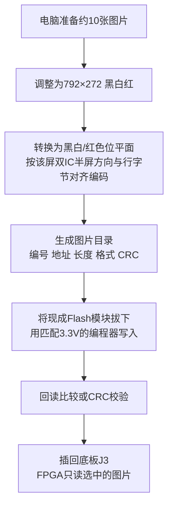

# W25Q32 图片到电子纸：接口、预存和运行流程

2026-09-26。此文为后续设计流程，不表示 RISC-V、表情模式、Flash 或电子纸驱动已经实现。

最重要的关系：**Flash → FPGA 的小缓存 → 电子纸。** Flash和电子纸都是SPI从设备，FPGA产生时钟、地址、片选及电子纸命令。新底板不需要再放CPU；连接器、缓冲和导线本身不能自动完成图片传输。

## 图件入口

- [离线交互总览](接线与流程总览.html)：支持图件缩放、按IO/球位/信号搜索全部40针。
- [01 系统数据路径](01_系统数据路径.png)，[SVG](01_系统数据路径.svg)。
- [02 十一路完整信号接线](02_信号连接.png)，[SVG](02_信号连接.svg)。
- [03 分块读Flash与写屏流程](03_分块传图流程.png)，[SVG](03_分块传图流程.svg)。
- [04 识别与刷新状态流程](04_识别刷新流程.png)，[SVG](04_识别刷新流程.svg)。
- [所有连接器和缓冲脚的详细方案](底板原理图接线方案.md)。

## 一、先修正当前截图

| 电子纸信号 | 当前截图 | 改为 | IDC脚 | 原因 |
|---|---|---|---:|---|
| DIN | User_3V3_IO0 | User_3V3_IO14 | 17 | IO0与冻结按键K2共用 |
| RST | User_3V3_IO8 | User_3V3_IO16 | 19 | IO8连板载配置Flash |
| PWR | User_3V3_IO12 | User_3V3_IO22 | 25 | IO12带CBSEL1启动配置功能 |

CLK/CS/DC/BUSY继续分别对应IO2/4/6/10。以上说的是经过缓冲后的电气对应关系。不要把U1/U2缓冲的输入和输出画成同一个网络，也不要在旁边再加一条直通导线。

连接器建议统一：J1=IDC40，J2=GH9P电子纸，J3=Flash六针排母，J4=剩余IO排针，J5=电源排针。U1/U2是两片SN74LVC244A。当前截图连接器10/11脚是否为固定/屏蔽脚，需要按实际封装确认。

## 二、图片如何预先放入Flash

后续可以增加FPGA的UART写图程序，代替外部编程器；该功能尚未实现。JPG/PNG是文件格式，不能直接作为屏幕像素数据发送。先前生成的表情PNG仍是预览素材，并未完成最终尺寸/位平面编码。

建议每图一个64KiB槽，最多先使用10槽，约640KiB；目录预留一个64KiB区，总共约704KiB。4MiB W25Q32容量足够此安排。示例分区是设计约定，尚未生成烧录镜像：

| 用途 | 地址范围或计算方法 |
|---|---|
| 图片目录 / 版本信息 | 0x000000～0x00FFFF |
| 图片槽0 | 0x010000～0x01FFFF |
| 图片槽1 | 0x020000～0x02FFFF |
| 图片槽2 | 0x030000～0x03FFFF |
| 图片槽3 | 0x040000～0x04FFFF |
| 图片槽9 | 0x0A0000～0x0AFFFF |
| 任意槽i | base=0x010000+i×0x10000，0≤i<10 |

槽头可占256字节，包含魔数/版本、792×272尺寸、色彩/存储格式、有效总长度、各半屏/颜色段的偏移与长度、CRC。具体段顺序和像素极性与后续移植的5.79 B驱动共同确定，不能靠“每图长度相同”猜测。

全屏双位平面紧凑存储为53,856字节；按两个396像素半屏每行补齐50字节，可构成4段×13,600字节=54,400字节的布局。加256字节头部仍小于64KiB。后一种是可采用的传输布局，不意味着当前已经实现相应驱动。

## 三、以“选中图片槽1”为例说明搬运

RISC-V把表情ID查表映射到图片ID。映射是应用配置，不要求表情ID等于Flash地址。例如把“难过”映射到槽1，则槽基址是0x020000；若采用256字节头部，第一段像素地址从0x020100开始，具体以头部描述为准。

### 阶段A：FPGA从Flash取1024字节

1. 确认选中图片的头部格式、长度和地址范围有效，并锁定 `active_id`。
2. `FLASH_CS=0`。用 `FLASH_CLK` 驱动，通过 `FLASH_MOSI`（模块DI）先发 `0x03`，再发地址的高、中、低三个字节。上述例子为 `03 02 01 00`。
3. 保持片选有效，再产生1024×8个时钟。从 `FLASH_MISO`（模块DO）采样1024字节到小RAM。MOSI在该读取数据阶段可发固定填充值，不能停止时钟却期待Flash继续吐数据。
4. `FLASH_CS=1`结束这一块读取。下一块用更新后的地址再发一次读取命令。标准0x03读在命令+24位地址后进入数据阶段，不额外套用快速读指令的dummy周期。

对应物理路径：

`Flash DO/J3-3 → U2-6输入 → U2-14输出 → 33Ω → J1-24 → 开发板IO21 → FPGA输入`。

地址和命令走另一个方向：

`FPGA IO20 → J1-23 → U1-17输入 → U1-3输出 → 33Ω → Flash DI/J3-6`。

### 阶段B：FPGA把缓冲数据发给电子纸

1. 在开始某个半屏/颜色段时，由电子纸驱动设置窗口、计数器和写RAM命令；命令阶段 `DC=0`。
2. 数据阶段 `DC=1`，根据驱动要求控制 `EPD_CS`，通过 `EPD_CLK` 和 `EPD_DIN`把缓冲中的1024字节发给屏内RAM。
3. 更新段内偏移；最后一块不足1024字节时只发送剩余长度，不能为了凑整块发送越界数据。
4. 当前段完成后切换到下一半屏/颜色段；所有段完成后检查总长度和CRC。

像素发送路径：

`FPGA IO14 → J1-17 → U1-2输入 → U1-18输出 → 33Ω → GH9P J2-3/DIN → 电子纸模块`。

CRC用于核对Flash读取的数据是否与存储目录一致。该接口没有屏幕像素回读确认，CRC通过不等于逐像素验证了屏幕端接收结果；仍需信号测量和实际显示测试。

### 阶段C：屏幕执行物理刷新

1. 只有全部图像数据成功准备完成，才发整屏刷新命令。
2. 将BUSY经过输入同步后交给控制程序；按该型号驱动的忙闲时序等待完成，并设置超时。
3. 刷新成功才更新 `displayed_id`，随后按驱动休眠或关电。超时不能把目标图片当作已经显示成功。

BUSY路径：

`电子纸 J2-8/BUSY → U2-4输入 → U2-16输出 → 33Ω → J1-13 → FPGA IO10输入`。

当前屏典型整屏刷新约24～25秒。按54,400字节、Flash与电子纸各1MHz顺序读写，纯载荷时间为 `54,400×8×2÷1,000,000 ≈ 0.8704秒`；还需加命令、初始化和软件时间。排队及刷新间隔另算。数据搬运快，不代表屏幕能立即换完图。

## 四、识别结果如何调度

- 识别硬件持续处理视频；RISC-V不在等待电子纸时阻塞摄像头或HDMI。
- `pending_id`只保存最新稳定结果；低置信度/无人状态不立即换图。
- 准备开始传图时把 `pending_id`复制到 `active_id`；同一次发送和刷新期间，`active_id`固定。
- BUSY期间如表情改变，只更新`pending_id`，不打断本次刷新、不无限排队。
- 只有刷新成功才设置`displayed_id=active_id`。相同图片不重复刷。
- 刷新间隔由独立定时策略控制。厂商Wiki建议至少180秒；这是重复刷新策略，与一次刷新约24～25秒的耗时不同。不能把识别频率直接设为换图频率。
- 初始化、Flash读取、总线传输和BUSY等待均需要错误路径。恢复次数有限；刷新超时后画面状态视为未知，恢复后再发送完整画面。

## 五、所有引脚如何落图

完整编号以[底板原理图接线方案](底板原理图接线方案.md)和[IDC40引脚分配CSV](IDC40引脚分配.csv)为准。分配计数：36信号=11个外设信号+25个引出信号；电源为3.3V、5V、两脚GND。11个外设信号=9个FPGA输出+2个输入。

J4全部25个IO对应关系已列出；其中IO0/1、8/9、12/13、18/19、26/27有按键或配置相关复用，不能按空闲通用IO接入其他驱动器。

本规划已检查脚号覆盖、球位、当前端口占用、缓冲A/Y配对和图件显示。没有替代CAD的ERC/DRC，也没有替代模块、线束和供电的实测。

## 资料

- 原板P4/核心板球位/电子纸模块接口：此前用户提供的本地PDF，具体路径见接线方案。
- [W25Q32JV官方手册](https://www.winbond.com/resource-files/W25Q32JV%20RevJ%2012242024%20Plus.pdf)：标准SPI读取、容量及供电。
- [微雪5.79 B官方说明](https://www.waveshare.com/wiki/5.79inch_e-Paper_Module_(B)_Manual)：双IC、半屏字节对齐、SPI和刷新策略。
